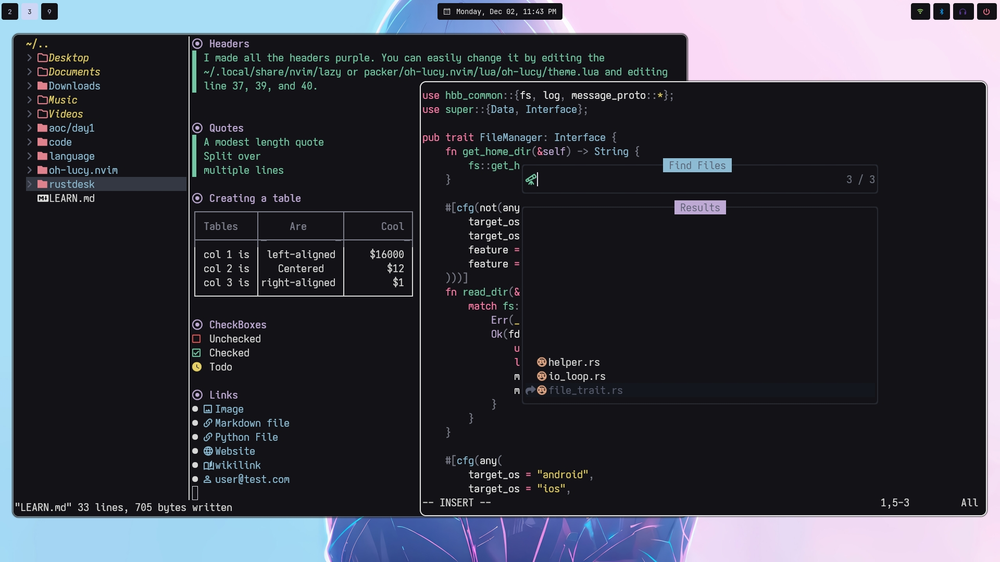

# About
> This is a fork of [oh-lucy.nvim](https://github.com/yazeed1s/oh-lucy.nvim) but a darker version. I removed the evening theme and fixed some of the coloring because by default some highlight groups
> rendered ugly like Headers and such in markdown files so I fixed those highlight and more. If you are going to use this I suggest forking it because I will be adjusting colors to my liking.

# Look

